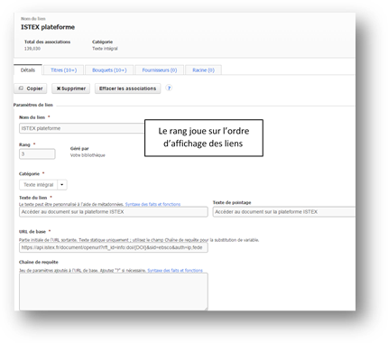
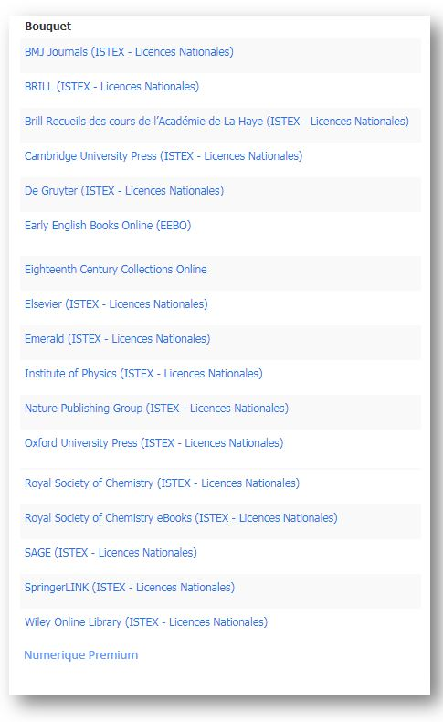


# OpenURL et Discovery Tool #

Cette documentation est à destination des gestionnaires de documentation (SCD) qui souhaitent paramétrer leur outil de découverte ("Discovery Tool") pour y ajouter les ressources ISTEX.

Une fonctionnalité intéressante de l’API ISTEX est son résolveur de liens compatible avec la norme OpenURL. Cette fonctionnalité permet de savoir, à partir de métadonnées simples (titre, auteurs…) ou d’identifiants standards (DOI, PMID…) si un document est présent dans la base de documents ISTEX. Si le document est trouvé, un rebond vers le texte plein est possible.

Les 3  Discovery Tool ou Outil de Découverte les plus utilisés actuellement sont :

- **EDS** et son résolveur FTF (EBSCO Discovery Service)

- **Primo** et son résolveur SFX (ExLibris/Proquest)_***En attente contact Ex-Libris USA***_

- **Summon** et son résolveur de liens 360 links (Serial Solution/ Proquest) _***En attente contact Ex-Libris USA***_ 

Ces réservoirs de métadonnées destinés aux bibliothèques permettent de faire une recherche à la "Google" et d’accéder :

- via un résolveur de liens au plein texte des articles des abonnements souscrits chez l'éditeur

- via une OpenURL au plein texte des articles des abonnements achetés dans le cadre des licences nationales ISTEX sur la plateforme ISTEX

Pour en savoir plus sur le **[résolveur OpenURL ISTEX](https://api.istex.fr/documentation/openurl/)**

====================================================================================

=> Si vous utilisez **un reverse proxy tel qu’EZproxy**, vous pouvez créer **une Stanza**  pour « l'api d'ISTEX » en utilisant les données suivantes :

**Title** Plateforme Istex (API)

**URL**   http://api.istex.fr/

**HJ**    https://api.istex.fr/

**DJ**    istex.fr

_Pour en savoir plus sur la configuration de l’EZproxy consulter le_ **[GitHub EZproxy de l’ESR](https://github.com/ezproxy-config/french/blob/master/Istex.txt)** 

====================================================================================

## EDS ##

### Accès au PDF après une recherche ###

Une recherche sur l’article suivant : *Tricuspid incompetence and right ventricular output in congestive heart failure*  de la revue **British Heart Journal  Janvier 1957, Vol. 19 Issue 1**,  du bouquet BMJ ISTEX

Deux propositions d'accès au PDF :

- Directement à partir de la plateforme ISTEX par OpenURL avec pérennité de l’accès

- Ou par rebond à partir du site de l'éditeur via le résolveur de lien FTF d'EBSCO

### Paramétrage du Holdings Management###

Le Holdings Management (HLM) dans EBSCOADMIN permet à l’administrateur du compte de gérer les collections ou abonnements et leur associer un résolveur de liens permettant l’accès au plein texte sur le site de l’éditeur.

#### 1- Liens éditeurs pour Bouquets ou Titres de ressources  

Dans le HLM en cliquant sur **"Liens"**, l’administrateur peut visualiser les liens éditeurs disponibles dans le module d'administration qu'il faudra associer à un **"Titres"** ou un **"Bouquets"** de ressources pour aller jusqu'au plein texte. Dans notre exemple : 51 liens sont disponibles

#### 2- Création d'un lien vers la plateforme ISTEX

Cliquer sur **"Nouveau lien"**

Remplir le formulaire **"Url\* de base"**

Avec `https://api.istex.fr/document/openurl`

Au niveau de la **"Chaîne de requête"** préciser le champ DOI et PMID plus le mode et l'ordre d'authentification : IP puis Fédération d'identité

`?rft_id=info:doi/{DOI}&rft_id=info:pmid/{PMID}&sid=ebsco&auth=ip,fede`

Ainsi que les métadonnées prises en comptes : 

`{IfNotEmpty({DOI}{PMID},ok,)}`

Ne pas oublier de cocher l'affichage du lien "Pour mes fonds documentaires associés" 

Pour personnifier l'affichage du lien, rajouter l’icône ISTEX dont l'URL est :

`https://content-delivery.istex.fr/assets/img/istex-minilink.png`

#####**Open URL : erreur 404 et Istex View**

 
Il peut y avoir une différence de contenu entre la liste des revues négociées avec les éditeurs, disponible au format Kbart sur le site des licences nationales, et les documents, réellement livrés en xml, disponibles sur la plateforme ISTEX.

 
 		
=> Un message code 404 peu **user friendly** s’affiche :

 
=> **Une couche IHM** (pour interface Homme-Machine) a été développée et rajoutée au-dessus de l'API ISTEX et en particulier de son OpenURL pour permettre l’affichage  d’un message plus explicite pour l’utilisateur. 		
Il suffit pour le voir de remplacer 
`https://api.istex.fr/document/openurl` par `https://view.istex.fr/document/openurl` dans le champ **« URL* de base »**  de la fenêtre de paramétrage du lien ISTEX plateforme.

 

=>Le message devient :

#### 3- Assigner le lien aux bouquets concernés

Une fois le lien créé il faut l’assigner à tous les bouquets  Licences Nationales ISTEX déjà présents dans la plateforme ISTEX :

- Les rechercher

- Les associer au lien OpenURL 

#####**!!!ATTENTION!!!**

Seuls les bouquets suivants sont déjà disponibles sur la plateforme ISTEX.

18 négociations mais 19 bouquets à sélectionner car la négociation "Numérique Premium" comporte 2 bouquets "Révolution française-Premier Empire" et "Littérature française et francophone".

## PRIMO et SUMMON ##

Actuellement il est impossible de proposer le même service avec ces deux solutions de découvertes leurs résolveurs de liens ne permettant pas de sélectionner des bouquets de ressouces "Licences nationales ISTEX" et d'y associer un lien vers l'éditeur et un lien vers la plateforme ISTEX. 
Le service Discovery et Delivery Ex-Libris USA a été contacté et étudie une solution.

