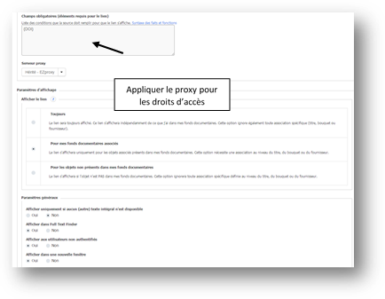


# OpenURL et Discovery Tool #

Une fonctionnalité intéressante de l’API ISTEX est son résolveur de liens compatible avec la norme OpenURL. Cette fonctionnalité permet de savoir, à partir de métadonnées simples (titre, auteurs…) ou d’identifiants standards (DOI, PMID…) si un document est présent dans la base de documents ISTEX. Si le document est trouvé, un rebond vers le texte plein est possible.

Les 3  Discovery Tool ou Outil de Découverte les plus utilisés actuellement sont :

- **EDS** et son résolveur FTF (EBSCO Discovery Service)

- **Primo** et son résolveur SFX (ExLibris/Proquest)_***En attente contact ex-libris USA***_

- **Summon** et son résolveur de liens 360 links (Serial Solution/ Proquest) _***En attente contact ex-libris USA***_ 

Ces réservoirs de métadonnées destinés aux bibliothèques permettent de faire une recherche à la "Google" et d’accéder :

- via un résolveur de liens aux plein texte des articles des abonnements souscrits chez l'éditeur

- via une OpenURL au plein texte des articles des abonnements achetés dans le cadre des licences nationales ISTEX sur la plateforme ISTEX

## EZ Proxy 

Pour paramétrer l'EZproxy la stanza nécessaire pour la **Plateforme Istex** se trouve

`https://github.com/ezproxy-config/french/blob/master/Istex.txt`

## EDS ##

### Accès au PDF après une recherche ###

Une recherche sur l’article suivant : *Tricuspid incompetence and right ventricular output in congestive heart failure*  de la revue **British Heart Journal  Janvier 1957, Vol. 19 Issue 1**,  du bouquet BMJ ISTEX

Deux propositions d'accès au PDF : 

- Directement à partir de la plateforme ISTEX par OpenURL avec pérennité de l’accès
- Ou par rebond à partir du site de l'éditeur via le résolveur de lien FTF d'EBSCO

### Paramétrage du Holdings Management###

Le Holdings Management (HLM) dans EBSCOADMIN permet à l’administrateur du compte de gérer les collections ou abonnements et leur associer un résolveur de liens permettant l’accès au plein texte sur le site de l’éditeur.

#### Liens éditeurs pour Bouquets ou Titres de ressources  

Dans le HLM en cliquant sur **"Liens"**, l’administrateur peut visualiser les liens éditeurs disponibles dans le module d'administration qu'il faudra associer à un **"Titres"** ou un **"Bouquets"** de ressources pour aller jusqu'au plein texte. Dans notre exemple : 51 liens sont disponibles

#### Création d'un lien vers la plateforme ISTEX

Cliquer sur **"Nouveau lien"**

Remplir le formulaire **"Url\* de base"**

Avec  `https://api.istex.fr/document/openurl?rft_id=info:doi/{DOI}&sid=ebsco&auth=ip,fede`

Puis le champ **"DOI"** sans oublier d'appliquer le proxy.

Pour personnifier l'affichage du lien, rajouter l’icône ISTEX dont l'URL est https://content-delivery.istex.fr/assets/img/istex-minilink.png

#### Assigner le lien aux bouquets concernés

Une fois le lien créé il faut l’assigner à tous les bouquets  Licences Nationales ISTEX déjà présents dans la plateforme ISTEX :

- Les rechercher

- Les associer au lien OpenURL 

**!!!ATTENTION!!!**

Les bouquets **Cambridge** , **Taylor Francis**, **Brill : New Pauly Online**, bien que déjà accessibles via les plateformes éditeurs, ne sont pas encore disponibles dans la plateforme ISTEX.

## PRIMO et SUMMON ##

Actuellement il est impossible de proposer le même service avec ces deux solutions de découvertes leurs résolveurs de liens ne permettant pas de sélectionner des bouquets de ressouces "Licences nationales ISTEX" et d'y associer un lien vers l'éditeur et un lien vers la plateforme ISTEX. 
Le service Discovery et Delivery ex-libris USA a été contacté et étudie une solution.

