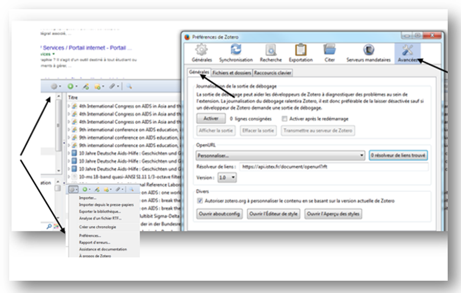

# OpenURL et Logiciel de Gestion Bibliographique

Les logiciels de gestion de bibliographie sont destinés à établir et gérer des listes de références bibliographiques afin de rédiger des articles, des ouvrages ou des thèses de doctorat. Dans ses références bibliographiques il est intéressant, pour faciliter le travail, d'y ranger le PDF de l'article ou du chapitre. L'OpenURL est une solution.

Pour en savoir plus sur le **[résolveur OpenURL ISTEX](https://api.istex.fr/documentation/openurl/)**

Exemple d'un logiciel libre et d'un logiciel propriétaire :

- **ZOTERO** 
- **ENDNOTE**

## ZOTERO  

### Paramètrage du module Préférences ###

- Aller dans le menu **"Actions"**

- Choisir **"Préférences" de Zotéro**

- Cliquer sur **"Avancées"**

- Sélectioner l'onglet **"Générales"**

- Renseigner au niveau de **"Résolveur de liens"** l'OpenURL ISTEX
  `https://api.istex.fr/document/openurl?rft`

- N'oublier pas de choisir la **version 1.0** pour l'OpenURL

**!!!ATTENTION!!!**  Un seul résolveur de lien OpenURL possible

### Accès au PDF après une recherche ###

- Cliquer sur la flèche verte **"Localiser"**

- Choisir **"Recherche dans la bibliothèque"** qui permet de rechercher le ou les documents sélectionnés en utilisant le résolveur de liens OpenURL renseigné dans le module **"Préférences"** de Zotéro.

- **"Enregistrer dans Zotero"** le PDF

- Faire glisser le PDF dans la notice

## ENDNOTE ##

### Paramètrage du module Préférences ###

- Aller dans le menu **"Edit"**

- Choisir **"Preference"**

- Dans "**EndNote Preferences"** aller dans **"Find Full Text"**

- Renseigner au niveau de **"Open URL Path"** le résolveur OpenURL ISTEX
  `https://api.istex.fr/document/openurl?rft`

- Cliquer sur **"Appliquer"**

### Accès au PDF après une recherche ###

- Sélectionner la notice ou les notices bibliographiques

- Clic droit /**"URL"**/**"Open URL Link"**

- **"Enregistrer dans EndNote"** le PDF trouvé
 

- Ouvrir la **"Reference"** concernée

- Dans le champ **"File Attachments"**/**"Attach file"**

- Chercher le PDF et **"Enregistrer"**

- Un trombone signale la présence du PDF

